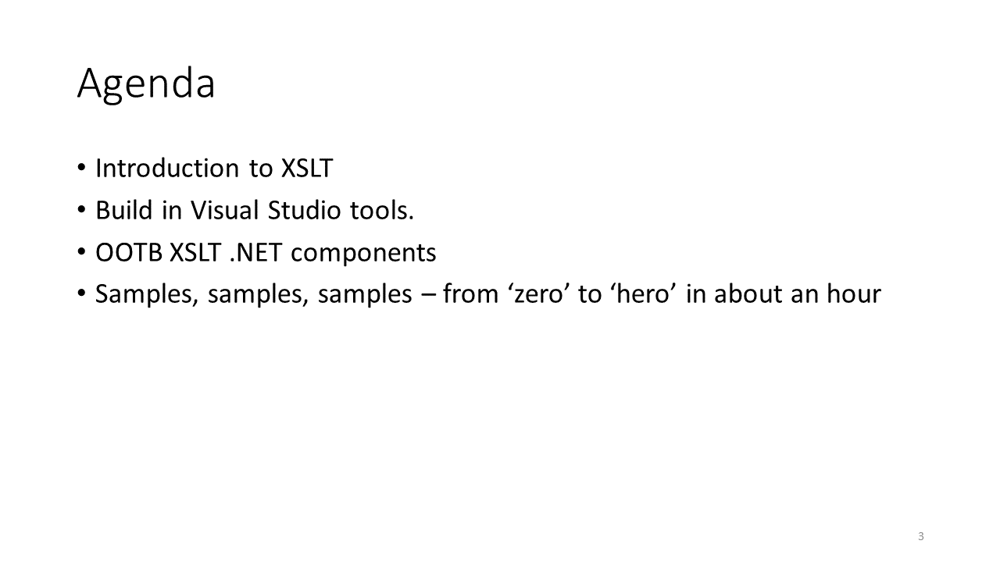
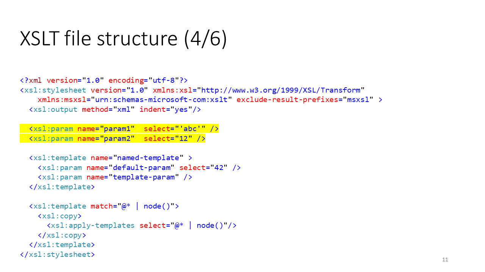
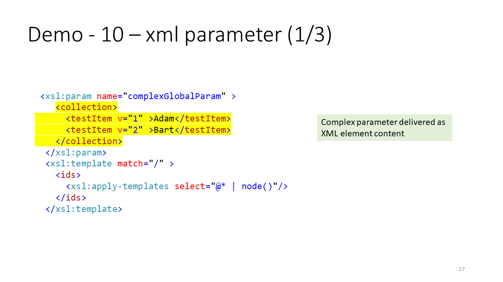

# Slides from presentation

## About me

## Agenda

## Key informations

## XLSL file structure

## XPath basics

## Demo 1

## XSLT only demo Components

## Demo - 2

## Demo - 3

## Demo - 4

## Demo -5

## Demo - 6

## Demo - 7

## Demo - 8

## Demo - 9

## Demo - 10

## Demo - 11

## Demo 12

* [XSLT Parameters](https://docs.microsoft.com/en-us/dotnet/standard/data/xml/xslt-parameters) https://docs.microsoft.com/en-us/dotnet/standard/data/xml/xslt-parameters

* [XslCompiledTransform Class](https://docs.microsoft.com/en-us/dotnet/api/system.xml.xsl.xslcompiledtransform) https://docs.microsoft.com/en-us/dotnet/api/system.xml.xsl.xslcompiledtransform
* [XSLT Functions](https://msdn.microsoft.com/en-us/library/ms256046.aspx) https://msdn.microsoft.com/en-us/library/ms256046.aspx
* [XSLT Parameters](https://docs.microsoft.com/en-us/dotnet/standard/data/xml/xslt-parameters) https://docs.microsoft.com/en-us/dotnet/standard/data/xml/xslt-parameters
* [Sources and slides on GitHub](https://github.com/MariuszKrzanowski/demo-unforgotten-xslt) https://github.com/MariuszKrzanowski/demo-unforgotten-xslt

